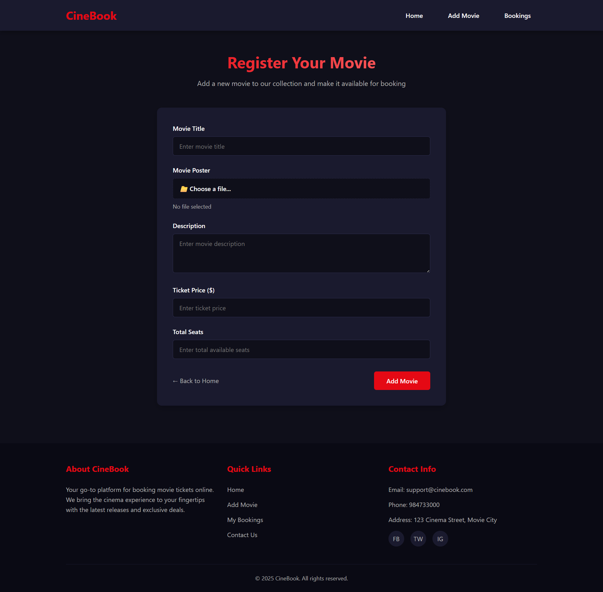
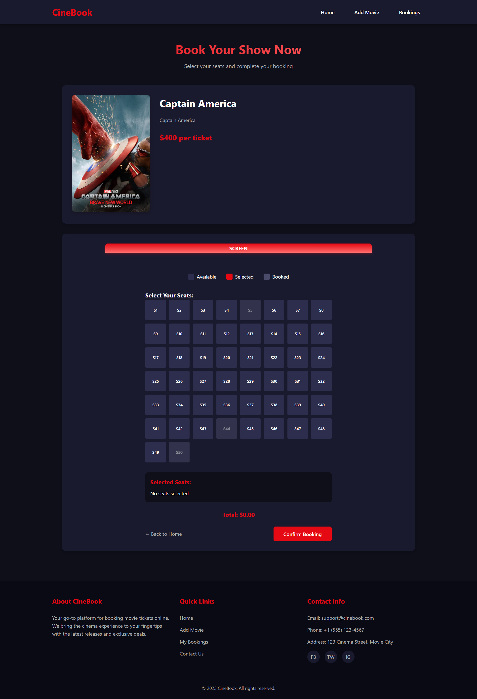

# Movie Booking System

A simple movie booking system built with **Node.js**, **Express**, **MongoDB**, **EJS**, and **Multer** for file uploads.

---

## Features

- View all movies
- Add new movies (with poster image)
- Book seats for a movie
- View booking history
- Dynamic seat booking

---

## Technologies Used

- Node.js
- Express.js
- MongoDB (local or Atlas)
- EJS (templating engine)
- Multer (file uploads)
- dotenv (environment variables)

---

## Screenshots

**Home Page (View Movies)**  


**Add Movie Page**  


**Book Movie Page**  


**Booking History Page**  


## Installation

1. **Clone the repository**

```bash
git clone https://github.com/bibeklams/Movie-Booking-App.git
cd Movie-Booking-App
```
